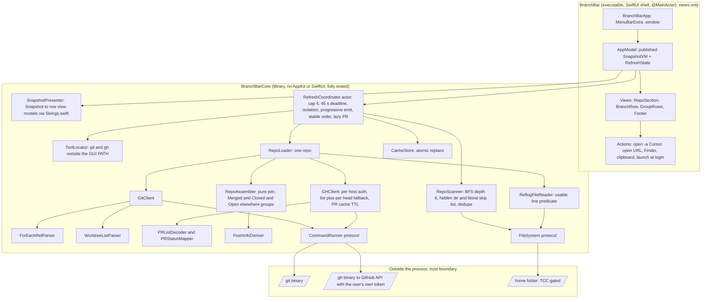

# ARCHITECTURE — BranchBar

<!-- How it works, current truth. DECISION-LOG.md holds why it changed. Rule: after any edit
     pass that shifts line numbers, run `make doc-refs` and fix every stale file:line before
     committing. -->

## §1 System overview

The app holds no credentials. `gh` authenticates itself from its own keyring; BranchBar reads only its stdout. Three protocols (`CommandRunner`, `FileSystem`, `CacheStore`) are the only routes to the outside world, and tests replace all three.

## §2 Key flows

Filled in as packets land: refresh sequence (3.2), push-time decision tree (2.1), scan classification (2.4), PR matching (2.3), packet DAG (PLAN.md §8).

## §3 Anatomy

| Concern | Where | Notes |
|---|---|---|
| (filled as packets land; every row verified by `make doc-refs`) | | |

## §4 Data model

Frozen in PLAN.md §5. Mutated only through `RefreshCoordinator`; the cache file at `~/Library/Application Support/BranchBar/cache.json` is written atomically and discarded on an unknown `schemaVersion`.

## §5 Testing

`make test` (`swift test --disable-xctest --enable-swift-testing`). Swift Testing only; XCTest is absent under Command Line Tools. Fixtures under `Tests/BranchBarCoreTests/Fixtures/` are `recorded-*` (written by `make record-fixtures` from real git and gh) or `synthetic-*` (hand-extended). See `docs/TEST-PLAN.md`.

## §6 Operations

Launched as `/Applications/BranchBar.app` (menu bar only, `LSUIElement`). Logs: `~/Library/Logs/BranchBar/BranchBar.log` and `log stream --predicate 'subsystem == "com.hannahstulberg.branchbar"'`. Runbooks in `docs/runbooks/`.

## §7 Security contract

No secrets stored or read. Only the fixed command list in PLAN.md §5 is ever spawned, always as argument arrays, never through a shell. Not sandboxed. See PLAN.md §6.

## §8 Known footguns

**`%1f` is a `for-each-ref` format atom, not a general git format atom.**
In `git reflog show` and `git log` formats it emits the literal text `%1f`, so a parser splitting on U+001F sees one field. Use `%x1f` there. Found during plan review by executing the command; a fixture recorded from the wrong command would have made the wrong parser pass.

**`git reflog show --format=… -- <ref>` returns zero rows and exit 0.**
`reflog show` does not treat `--` as an end-of-options marker; the ref becomes a pathspec and matches nothing. Omit `--` for this command only. `for-each-ref -- refs/heads` does accept it.

**The GUI app PATH has no Homebrew.**
A launched `.app` sees `/usr/bin:/bin:/usr/sbin:/sbin`, so `gh` at `/opt/homebrew/bin` is invisible. `ToolLocator` searches known install locations explicitly and records where it looked.

**`%(upstream:track,nobracket)` is empty for two different reasons.**
An in-sync branch and a branch with no upstream both yield an empty field. Decide "no upstream" from `%(upstream:short)`, never from the track field.

**Reflog files can exist and be empty, and a push deletion looks like a push.**
`.git/logs/refs/remotes/origin/<branch>` may be zero bytes; `git push --delete` appends an `update by push` line whose new OID is all zeros; lines expire after 90 days. A usable push line is one with a non-zero new OID; anything else falls back to the tip commit date with wording that does not claim a push was observed.

**`gh pr list --json headRepositoryOwner` returns an object.**
Compare `.login`, not the value. `reviewDecision` is an empty string, not null, when no decision exists.

**Never add `resources:` to `Package.swift`, and never add a `main.swift`.**
A resource declaration makes SwiftPM emit a side bundle next to the executable that breaks the `.app` layout and signing; a `main.swift` disables `-parse-as-library` and breaks `@main`. Fixtures load via `#filePath`; the entry file is `BranchBarApp.swift`.
